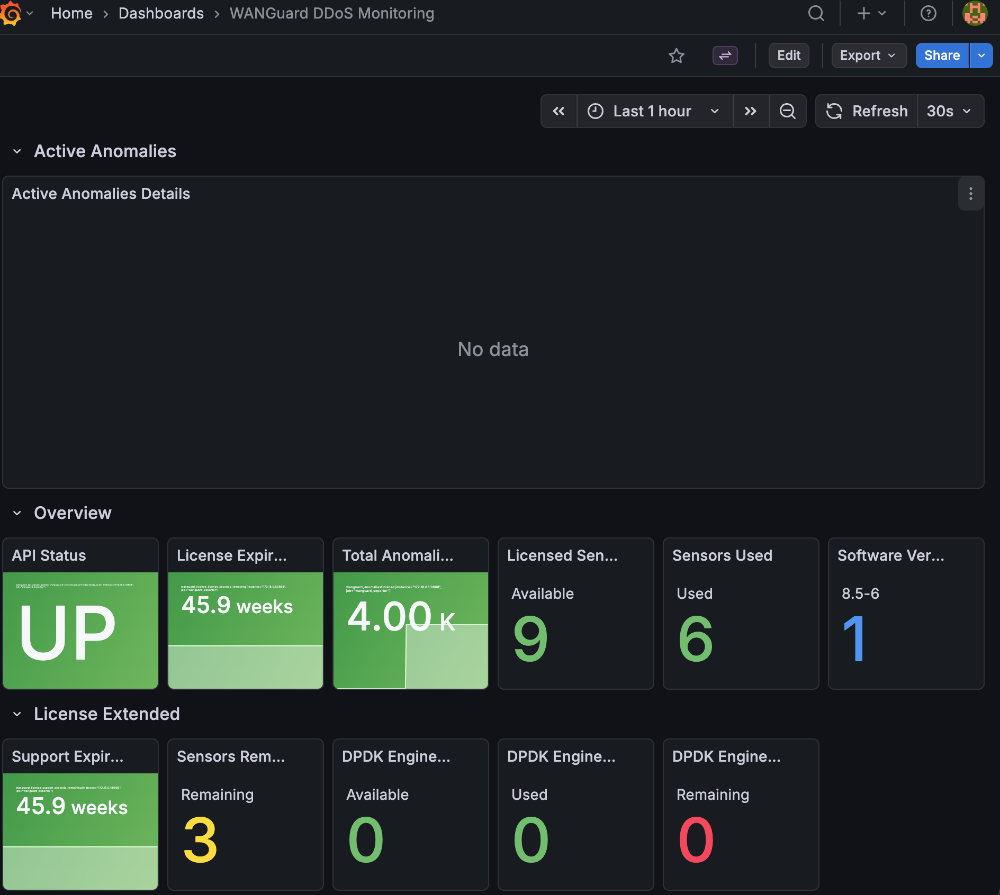
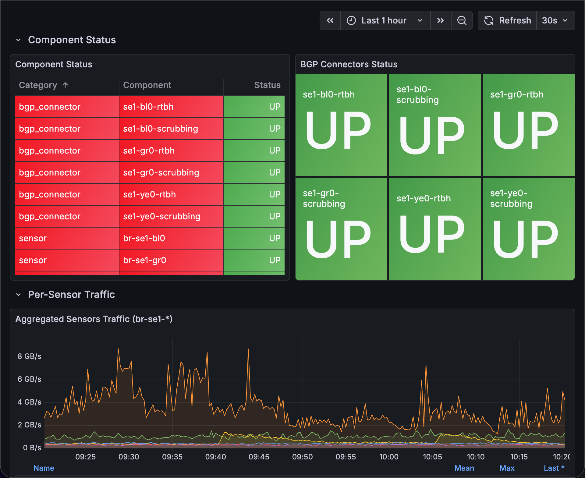
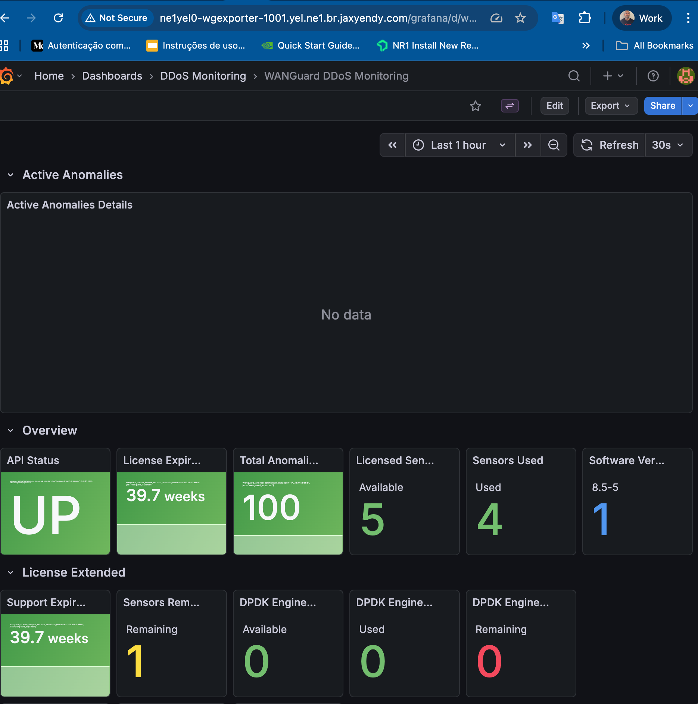
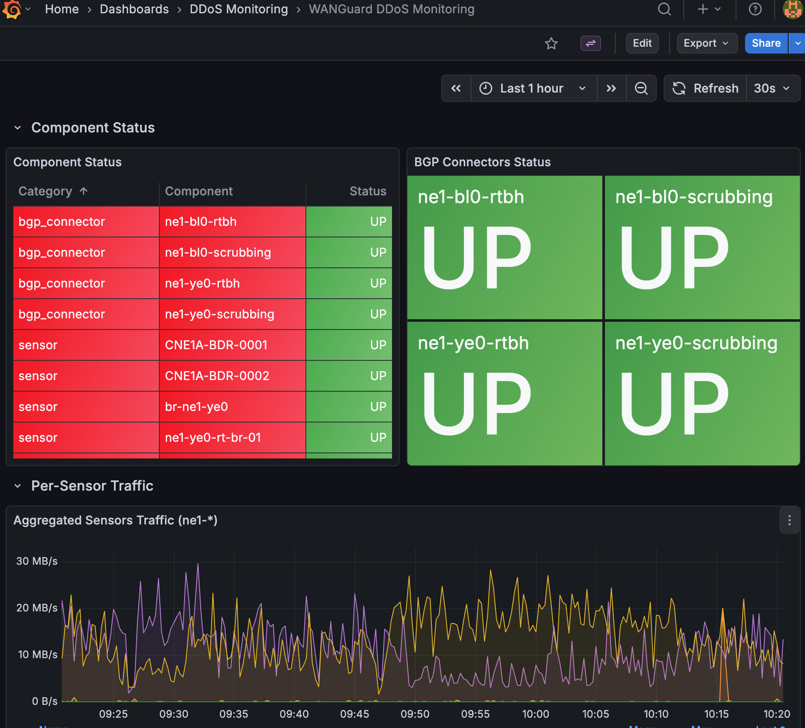

# Report: WANGuard DDoS Monitoring Dashboard V2

**Data:** 2026-03-13
**Solicitante:** Luiz Fagner (Redes - ISRE-NET)
**Executor:** Reinaldo Saraiva (SRE)
**Status:** COMPLETE

---

## 1. Objetivo

Implementar visibilidade de anomalias DDoS ativas diretamente no Grafana para
que o time RCC consiga monitorar ataques sem precisar acessar o console WANGuard.
Adicionalmente, implementar monitoramento dos BGP connectors utilizados na
mitigacao (RTBH e Scrubbing/Diversion).

## 2. Escopo

- Novo collector Go para BGP connectors com metricas detalhadas
- Labels enriquecidos nas anomalias ativas (sensor, severity, decoder, etc.)
- Reorganizacao do dashboard Grafana com Active Anomalies no topo
- Deploy em dois sites: SE1 e NE1
- Correcao de testes pre-existentes no exporter

## 3. Implementacao

### 3.1 BGP Connector Collector

Novo collector (`collectors/bgp_collector.go`) que expoe a metrica
`wanguard_bgp_connector_up` com os seguintes labels:

| Label | Descricao | Exemplo |
|-------|-----------|---------|
| connector_name | Nome do connector | se1-bl0-rtbh |
| connector_id | ID numerico | 1 |
| connector_role | Funcao | Mitigation / Diversion |
| device_group | Grupo de dispositivo | br-se1-bl0 |
| flowspec | Status FlowSpec | Disabled |

Valor: `1` = Active, `0` = Down

### 3.2 Anomaly Labels Enriquecidos

6 novos labels adicionados a metrica `wanguard_anomaliesactive`:

| Label | Descricao |
|-------|-----------|
| severity | Nivel de severidade do ataque |
| direction | Direcao (Incoming/Outgoing) |
| ip_group | Grupo IP afetado |
| decoder | Tipo do ataque (ICMP, UDP, TCP SYN, etc.) |
| sensor | Interface do sensor que detectou |
| response | Response policy ativada |

### 3.3 Dashboard Reorganizado

Layout final do dashboard (de cima para baixo):

```
+----------------------------------------------------------+
| Active Anomalies                                         |
|   Active Anomalies Details (tabela full-width)           |
|   Colunas: ID | Prefix | Anomaly | Sensor Interface |   |
|            Severity | Duration | Pkts/s | Bits/s         |
+----------------------------------------------------------+
| Overview                                                 |
|   API Status | License | Total Anomalies | Sensors | Ver |
+----------------------------------------------------------+
| License Extended                                         |
| Sensor Extended Metrics                                  |
| Traffic Overview (Bytes/sec + Packets/sec)               |
| Traffic Analysis - Bytes IN/OUT                          |
| Traffic Analysis - Packets IN/OUT                        |
| Sensor Performance (CPU/RAM/Load)                        |
| Component Status + BGP Connectors Status                 |
| Per-Sensor Traffic                                       |
+----------------------------------------------------------+
```

Principais mudancas no layout:
- **Active Anomalies no topo** - primeira coisa visivel ao abrir o dashboard
- Tabela de anomalias com colunas **Sensor Interface** e **Severity**
- Paineis redundantes removidos (Count, Finished, Mitigation Status)

### 3.4 Correcao de Testes

Corrigidos bugs pre-existentes em 10 arquivos de teste que impediam a
execucao da suite de testes:

- Assinatura de funcao incorreta em `wg_client_test.go`
- Arity errada em `os.Getenv` e `NewClient` em 8 arquivos de teste
- Deadlock por buffer insuficiente em `sensors_collector_test.go`
- Contagem incorreta de descriptors em `traffic_collector_test.go`
- Ausencia de Content-Type header no test server

Todos os testes passando apos as correcoes.

## 4. Evidencias

### 4.1 Site SE1 - Dashboard Topo



**Observacoes:**
- Active Anomalies Details como primeira secao do dashboard
- "No data" indica nenhuma anomalia DDoS ativa no momento (operacao normal)
- Overview mostrando: API UP, License 45.9 weeks, 4.00K anomalias totais historicas,
  9 sensores licenciados, 6 em uso, versao 8.5-6

### 4.2 Site SE1 - Component Status e Traffic



**Observacoes:**
- Component Status: 6 BGP connectors (3 sites x 2 tipos) todos UP
  - se1-bl0-rtbh, se1-bl0-scrubbing
  - se1-gr0-rtbh, se1-gr0-scrubbing
  - se1-ye0-rtbh, se1-ye0-scrubbing
- Sensores br-se1-bl0 e br-se1-gr0 todos UP
- BGP Connectors Status: 6 indicadores verdes (RTBH + Scrubbing por site)
- Aggregated Sensors Traffic (br-se1-*): trafego operacional variando entre
  2-8 GB/s com padrao normal

### 4.3 Site NE1 - Dashboard Topo



**Observacoes:**
- Mesmo layout do SE1: Active Anomalies Details no topo
- Overview: API UP, License 39.7 weeks, 100 anomalias totais, 5 sensores
  licenciados, 4 em uso, versao 8.5-5
- Dashboard acessivel via URL publica do site NE1

### 4.4 Site NE1 - Component Status e Traffic



**Observacoes:**
- Component Status: 4 BGP connectors (2 sites x 2 tipos) todos UP
  - ne1-bl0-rtbh, ne1-bl0-scrubbing
  - ne1-ye0-rtbh, ne1-ye0-scrubbing
- Sensores: CNE1A-BDR-0001, CNE1A-BDR-0002, br-ne1-ye0, ne1-ye0-rt-br-01 todos UP
- Aggregated Sensors Traffic (ne1-*): trafego entre 10-30 MB/s com padrao normal
- Filtro de sensor ajustado para `ne1.*` (ao inves de `br-se1.*` do template SE1)

## 5. Sites Deployados

| Site | Hostname | Sensores | BGP Connectors | Metricas | Status |
|------|----------|----------|----------------|----------|--------|
| SE1 | se1gre0-wgexporter-1001 | 6 | 6 (3 RTBH + 3 Diversion) | ~615 | COMPLETE |
| NE1 | ne1yel0-wgexporter-1001 | 4 | 4 (2 RTBH + 2 Diversion) | ~470 | COMPLETE |

## 6. Metricas Novas Disponiveis

```promql
# Status de cada BGP connector (1=Active, 0=Down)
wanguard_bgp_connector_up{connector_role="Mitigation"}
wanguard_bgp_connector_up{connector_role="Diversion"}

# Anomalias ativas com labels enriquecidos
wanguard_anomaliesactive{sensor="br-se1-bl0", severity="High"}

# Exemplos de alertas possiveis
wanguard_bgp_connector_up == 0  # BGP connector down
wanguard_anomaliesactive > 0    # Ataque DDoS ativo
```

## 7. Codigo Publicado

Repositorio GitLab: `cloud/reliability/networking/automations/wanguard-exporter`

Commits relevantes:
- `feat: add BGP connector collector and enhance anomaly labels`
- `fix(dashboard): move Active Anomalies below Overview and remove Mitigation section`
- `feat(dashboard): prioritize Active Anomalies at top and add sensor/severity columns`

## 8. Proximos Passos

- [ ] Parametrizar regex do sensor via variavel Grafana template para evitar
      customizacao manual por site
- [ ] Configurar alerting rules no Prometheus para anomalias ativas e BGP connectors down
- [ ] Implementar collector de Response actions (metricas de mitigacao ativa)
- [ ] Dashboard de Attack Analytics: top prefixes, distribuicao por decoder/severity
- [ ] Deploy em sites adicionais conforme demanda
- [ ] Unificar dashboards multi-site em Grafana centralizado
